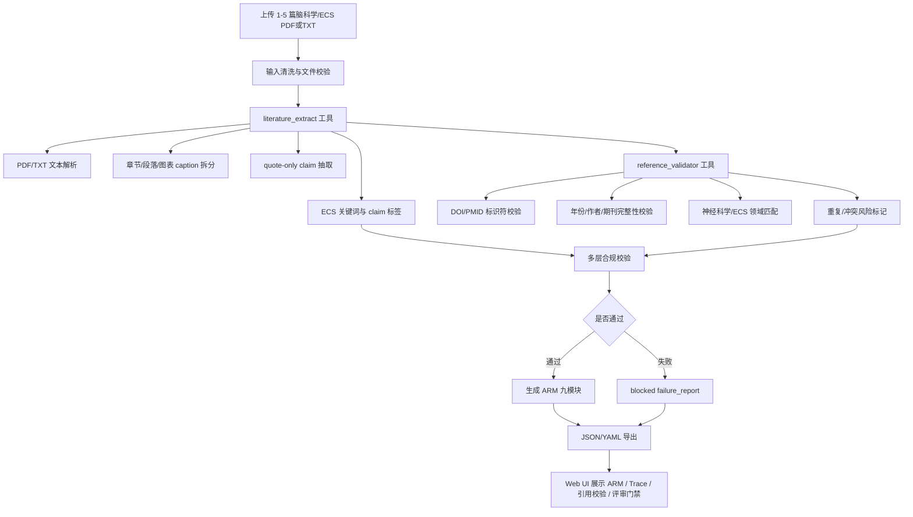

# A赛道 Paper-to-ARM 系统流程图

## 端到端流程

## 工具边界

- 允许工具 1：`literature_extract`
  - 输入：论文文件路径。
  - 输出：metadata、sections、figures_tables、candidate_claims、references、quality_flags。
  - 约束：claim 只摘抄原文；模型不得扩写原文结论。

- 允许工具 2：`reference_validator`
  - 输入：论文内全部引用文本、DOI、PMID、标题候选。
  - 输出：`reference_valid` / `reference_invalid`、逐条校验记录和 summary。
  - 约束：无 DOI/PMID 标记 `reference_requires_review`，不静默通过。

## ARM 输出模块

1. metadata
2. claims
3. evidence
4. protocol
5. runbook
6. eval_plan
7. provenance
8. limitations
9. artifacts

## 失败阻断逻辑

以下情况进入 blocked failure report：

- 输入为空或超过 5 篇。
- 少于 5 条可追溯 claim。
- 无 ECS 信息。
- 无图表/参考文献且批量上下文也无法补足。
- 单篇 research paper 缺 methods/results。
- PDF/TXT 无法解析。

失败分支不生成成功 ARM，只导出 failure_report 和 trace_record。

